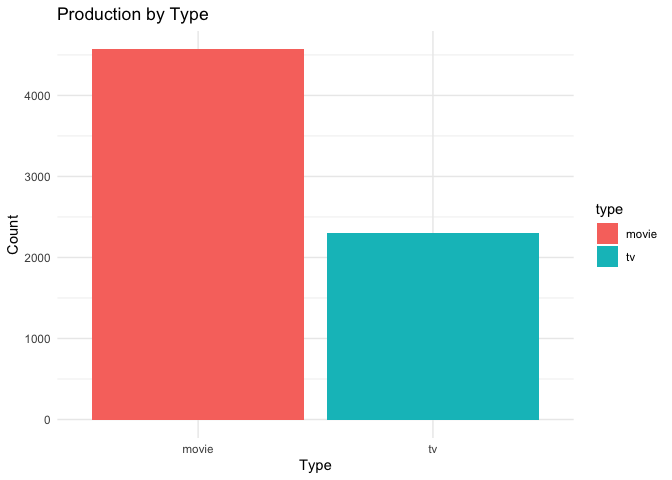
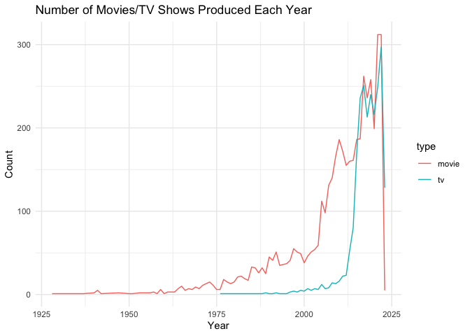
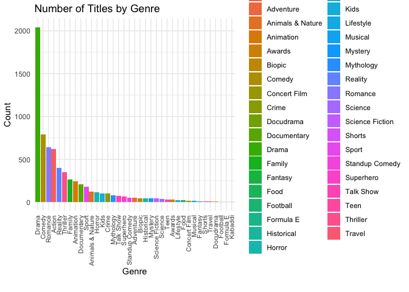
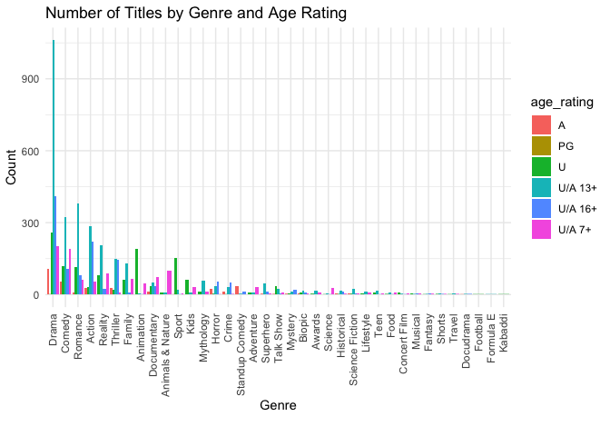

Understanding Hotstar’s Content Dynamics: Production Trends by Genre,
Type, and Age Rating
================

## Introduction

This analysis delves into the content dynamics of Hotstar, one of the
leading streaming platforms. By examining a dataset comprising various
titles available on Hotstar, this study aims to uncover key patterns and
trends in content production. The analysis focuses on understanding the
distribution of different content types, such as movies and TV shows,
and explores how genres and running times vary across different age
ratings. Additionally, it identifies the most and least common genres,
highlights the titles with the longest and shortest durations, and
provides insights into the production trends over the years. This
comprehensive overview offers valuable insights into Hotstar’s content
strategy, catering to diverse audiences and shaping its offerings in the
competitive streaming landscape.

## Including Code

You can include R code in the document as follows:

``` r
# Clear the environment
rm(list = ls())

# Load necessary packages and install if not already installed
required_packages <- c("Hmisc", "dplyr", "ggplot2", "tidyr")

for (pkg in required_packages) {
  if (!require(pkg, character.only = TRUE)) {
    install.packages(pkg, dependencies = TRUE)
    library(pkg, character.only = TRUE)
  }
}
```

    ## Loading required package: Hmisc

    ## 
    ## Attaching package: 'Hmisc'

    ## The following objects are masked from 'package:base':
    ## 
    ##     format.pval, units

    ## Loading required package: dplyr

    ## 
    ## Attaching package: 'dplyr'

    ## The following objects are masked from 'package:Hmisc':
    ## 
    ##     src, summarize

    ## The following objects are masked from 'package:stats':
    ## 
    ##     filter, lag

    ## The following objects are masked from 'package:base':
    ## 
    ##     intersect, setdiff, setequal, union

    ## Loading required package: ggplot2

    ## Loading required package: tidyr

``` r
# Read the CSV file (update the path as per your local setup)
data <- read.csv("~/Data Analysis/hotstar.csv")

# Duplicate the 'seasons' and 'episodes' columns and replace NAs with 1
data <- data %>%
  mutate(
    seasons_dup = ifelse(is.na(seasons), 1, seasons),
    episodes_dup = ifelse(is.na(episodes), 1, episodes)
  )

# Display the first few rows of the modified data
head(data)
```

    ##   hotstar_id                               title
    ## 1 1000087439               Sambha - Aajcha Chawa
    ## 2 1260023113 Cars Toon: Mater And The Ghostlight
    ## 3 1260103188               Kanmani Rambo Khatija
    ## 4 1260126754                           Butterfly
    ## 5 1260018228                          Sister Act
    ## 6 1000218684                             Traffic
    ##                                                                                                                                                  description
    ## 1                                                                 A young man sets off on a mission to clean up the society from corruption and other evils.
    ## 2                                     Mater is haunted by a mysterious blue light that teaches him not to play pranks on the other cars in Radiator Springs.
    ## 3         Unlucky since birth, Rambo finds hope when he falls in love with Kanmani and Khatija. His life gets complicated further when they both pursue him.
    ## 4            While trying to rescue her sister's kids from kidnappers, Geetha excavates shocking secrets about her dubious neighbours. What are they hiding?
    ## 5          Rene, a lounge singer, decides to stay at a Christian convent where she changes the dynamics of the convent when she begins to sing in the choir.
    ## 6 A traffic constable accepts the challenge of traversing 150 km by road to transport a donor's heart for an immediate transplant. Inspired by a true event.
    ##       genre year age_rating running_time seasons episodes  type seasons_dup
    ## 1    Action 2012    U/A 16+          141      NA       NA movie           1
    ## 2 Animation 2006          U            7      NA       NA movie           1
    ## 3   Romance 2022    U/A 16+          157      NA       NA movie           1
    ## 4  Thriller 2022    U/A 16+          136      NA       NA movie           1
    ## 5    Comedy 1992     U/A 7+          100      NA       NA movie           1
    ## 6     Drama 2016          U          100      NA       NA movie           1
    ##   episodes_dup
    ## 1            1
    ## 2            1
    ## 3            1
    ## 4            1
    ## 5            1
    ## 6            1

## Optionally describe the updated data

``` r
describe(data)
```

    ## data 
    ## 
    ##  12  Variables      6874  Observations
    ## --------------------------------------------------------------------------------
    ## hotstar_id 
    ##         n   missing  distinct      Info      Mean       Gmd       .05       .10 
    ##      6874         0      6874         1 1.059e+09 472828282 8.204e+03 1.462e+04 
    ##       .25       .50       .75       .90       .95 
    ## 1.000e+09 1.260e+09 1.260e+09 1.610e+09 1.770e+09 
    ##                                                                          
    ## Value      0.00e+00 1.00e+09 1.10e+09 1.22e+09 1.26e+09 1.60e+09 1.62e+09
    ## Frequency       957     2197       36        1     2864      132        4
    ## Proportion    0.139    0.320    0.005    0.000    0.417    0.019    0.001
    ##                                               
    ## Value      1.66e+09 1.76e+09 1.80e+09 1.82e+09
    ## Frequency        41      470       40      132
    ## Proportion    0.006    0.068    0.006    0.019
    ## 
    ## For the frequency table, variable is rounded to the nearest 20000000
    ## --------------------------------------------------------------------------------
    ## title 
    ##        n  missing distinct 
    ##     6874        0     6677 
    ## 
    ## lowest : …Re                     & Jara Hatke            #Mentoo                 10 Endrathukulla        10 Enradhukulla Special
    ## highest: Zindagi Mere Ghar Aana  Zootopia                Zootopia+               Zoya                    Zubaan                 
    ## --------------------------------------------------------------------------------
    ## description 
    ##        n  missing distinct 
    ##     6874        0     6815 
    ## 
    ## lowest : "Bellary Raja gets abandoned by his stepfather in his childhood. Years later, his stepfather calls him back only to resolve the disputes between his children. 
    ## " "Director by Night" follows film composer Michael Giacchino’s first foray into directing.                                                                          "Fauci" examines the life of Dr. Fauci, a public servant and physician, whose career spans seven presidents, and every pandemic from AIDS to COVID-19.             "Playing with Sharks" captures the life of Valerie Taylor, a living legend and true pioneer in both underwater filmmaking and shark research.                      "The Ballad of Nessie" is a whimsical and colourful tale about the friendly Loch Ness monster, Nessie, and her best friend MacQuack, the rubber duck.             
    ## highest: Zed and Addison's final year at Seabrook is disrupted by the arrival of intergalactic outsiders.                                                                   Zen – Grogu and Dust Bunnies is a hand drawn animated short by Studio Ghibli.                                                                                      Zenimation pays tribute to both the visual and sound artists who have created Walt Disney Animation Studios’ legacy of films.                                      Zeus accuses Poseidon's demigod son, Percy Jackson, of the theft and threatens to wage war if his master bolt isn't retrieved within two weeks.                    Zoologist Jack Randall journeys into Australia's Outback to encounter extraordinary wildlife.                                                                     
    ## --------------------------------------------------------------------------------
    ## genre 
    ##        n  missing distinct 
    ##     6874        0       37 
    ## 
    ## lowest : Action           Adventure        Animals & Nature Animation        Awards          
    ## highest: Superhero        Talk Show        Teen             Thriller         Travel          
    ## --------------------------------------------------------------------------------
    ## year 
    ##        n  missing distinct     Info     Mean      Gmd      .05      .10 
    ##     6874        0       78    0.997     2012    11.54     1986     1995 
    ##      .25      .50      .75      .90      .95 
    ##     2009     2016     2019     2022     2022 
    ## 
    ## lowest : 1928 1937 1940 1941 1942, highest: 2019 2020 2021 2022 2023
    ## --------------------------------------------------------------------------------
    ## age_rating 
    ##        n  missing distinct 
    ##     6874        0        6 
    ##                                                           
    ## Value            A      PG       U U/A 13+ U/A 16+  U/A 7+
    ## Frequency      338       1    1251    2980    1235    1069
    ## Proportion   0.049   0.000   0.182   0.434   0.180   0.156
    ## --------------------------------------------------------------------------------
    ## running_time 
    ##        n  missing distinct     Info     Mean      Gmd      .05      .10 
    ##     4568     2306      187        1    98.75    53.93        8       13 
    ##      .25      .50      .75      .90      .95 
    ##       70      116      135      148      155 
    ## 
    ## lowest :   1   2   3   4   5, highest: 190 194 199 226 229
    ## --------------------------------------------------------------------------------
    ## seasons 
    ##        n  missing distinct     Info     Mean      Gmd      .05      .10 
    ##     2306     4568       40    0.677    2.662    2.883        1        1 
    ##      .25      .50      .75      .90      .95 
    ##        1        1        2        6       10 
    ## 
    ## lowest :  1  2  3  4  5, highest: 43 45 53 67 73
    ## --------------------------------------------------------------------------------
    ## episodes 
    ##        n  missing distinct     Info     Mean      Gmd      .05      .10 
    ##     2306     4568      495    0.999    127.4    191.9      1.0      1.0 
    ##      .25      .50      .75      .90      .95 
    ##      6.0     22.0    130.8    382.0    642.5 
    ## 
    ## lowest :    1    2    3    4    5, highest: 1895 1943 2348 2732 3973
    ## --------------------------------------------------------------------------------
    ## type 
    ##        n  missing distinct 
    ##     6874        0        2 
    ##                       
    ## Value      movie    tv
    ## Frequency   4568  2306
    ## Proportion 0.665 0.335
    ## --------------------------------------------------------------------------------
    ## seasons_dup 
    ##        n  missing distinct     Info     Mean      Gmd      .05      .10 
    ##     6874        0       40    0.285    1.557    1.065        1        1 
    ##      .25      .50      .75      .90      .95 
    ##        1        1        1        2        4 
    ## 
    ## lowest :  1  2  3  4  5, highest: 43 45 53 67 73
    ## --------------------------------------------------------------------------------
    ## episodes_dup 
    ##        n  missing distinct     Info     Mean      Gmd      .05      .10 
    ##     6874        0      495    0.659    43.39    77.94      1.0      1.0 
    ##      .25      .50      .75      .90      .95 
    ##      1.0      1.0      6.0     95.7    254.3 
    ## 
    ## lowest :    1    2    3    4    5, highest: 1895 1943 2348 2732 3973
    ## --------------------------------------------------------------------------------

``` r
# 1. Determine which type has comparatively high production
production_summary <- data %>%
  group_by(type) %>%
  summarize(Count = n()) %>%
  arrange(desc(Count))
```

# Plot production by type

<!-- -->

# 2. Identify titles with the highest and lowest running time

``` r
running_time_summary <- data %>%
  filter(!is.na(running_time)) %>%
  arrange(running_time)
```

# Display titles with highest and lowest running time

``` r
highest_running_time <- tail(running_time_summary, 1)
lowest_running_time <- head(running_time_summary, 1)

print("Title with the Highest Running Time:")
```

    ## [1] "Title with the Highest Running Time:"

``` r
print(highest_running_time)
```

    ##      hotstar_id                                                title
    ## 4568 1260127955 The 2022 Rock & Roll Hall of Fame Induction Ceremony
    ##                                                                                                                                                    description
    ## 4568 The Rock & Roll Hall of Fame inducts Pat Benatar and Neil Giraldo, Duran Duran, Eminem, Eurythmics, Dolly Parton, Lionel Richie, Carly Simon, and others.
    ##             genre year age_rating running_time seasons episodes  type
    ## 4568 Concert Film 2022    U/A 16+          229      NA       NA movie
    ##      seasons_dup episodes_dup
    ## 4568           1            1

``` r
print("Title with the Lowest Running Time:")
```

    ## [1] "Title with the Lowest Running Time:"

``` r
print(lowest_running_time)
```

    ##   hotstar_id      title
    ## 1 1000085966 Dr. Cabbie
    ##                                                                                                                                           description
    ## 1 After delivering a baby in a cab, Dr. Deepak Chopra he realises there is a way to use the skills that the Canadian government doesn't seem to want.
    ##    genre year age_rating running_time seasons episodes  type seasons_dup
    ## 1 Comedy 2014    U/A 16+            1      NA       NA movie           1
    ##   episodes_dup
    ## 1            1

``` r
# Plot running time by genre instead of title
data_separated <- data %>%
  separate_rows(genre, sep = ",") %>%
  group_by(genre) %>%
  summarize(
    max_running_time = ifelse(all(is.na(running_time)), NA, max(running_time, na.rm = TRUE)),
    min_running_time = ifelse(all(is.na(running_time)), NA, min(running_time, na.rm = TRUE))
  ) %>%
  arrange(desc(max_running_time))
```

<!-- -->

# 3. Show the number of movies or TV shows produced each year

``` r
yearly_production <- data %>%
  filter(!is.na(year)) %>%
  group_by(year, type) %>%
  summarize(Count = n(), .groups = 'drop')
```

# Plot production by year

<!-- -->

# 4. Count the number of titles by genre

``` r
genre_count <- data %>%
  separate_rows(genre, sep = ",") %>%
  group_by(genre) %>%
  summarize(Count = n()) %>%
  arrange(desc(Count))
```

<!-- -->

# 5. Find the title with the maximum seasons

``` r
max_seasons_title <- data %>%
  filter(!is.na(seasons)) %>%
  arrange(desc(seasons)) %>%
  slice(1)  # Get the first row with the maximum seasons

# Display the title with maximum seasons
print("Title with the Maximum Seasons:")
```

    ## [1] "Title with the Maximum Seasons:"

``` r
print(max_seasons_title)
```

    ##   hotstar_id          title
    ## 1        363 Savdhaan India
    ##                                                                                                                                                     description
    ## 1 From a dangerous murder plot to a thoroughly planned robbery, unmask the gory face of terror through a dramatised version of the crimes happening around you!
    ##   genre year age_rating running_time seasons episodes type seasons_dup
    ## 1 Crime 2012    U/A 16+           NA      73     2348   tv          73
    ##   episodes_dup
    ## 1         2348

# 6. Find the title with the maximum episode

``` r
max_episode_title <- data %>%
  filter(!is.na(episodes_dup)) %>%
  arrange(desc(episodes_dup)) %>%
  slice(1)  # Get the first row with the maximum episode

# Display the title with maximum episdoe
  print("Title with the Maximum Seasons:")
```

    ## [1] "Title with the Maximum Seasons:"

``` r
  print(max_episode_title)
```

    ##   hotstar_id                      title
    ## 1        586 Yeh Rishta Kya Kehlata Hai
    ##                                                                                                                                               description
    ## 1 A personal tragedy creates a rift in Abhimanyu and Akshara’s marital life. Years later, when destiny offers a second chance, will the duo embrace love?
    ##   genre year age_rating running_time seasons episodes type seasons_dup
    ## 1 Drama 2023    U/A 13+           NA      67     3973   tv          67
    ##   episodes_dup
    ## 1         3973

# 7.Count the number of titles by genre for each age rating

``` r
  genre_age_rating <- data %>%
  separate_rows(genre, sep = ",") %>%
  group_by(age_rating, genre) %>%
  summarize(Count = n(), .groups = 'drop') %>%  
  arrange(age_rating, desc(Count))
  
  # Display the summarized data
  print(genre_age_rating)
```

    ## # A tibble: 144 × 3
    ##    age_rating genre          Count
    ##    <chr>      <chr>          <int>
    ##  1 A          Drama            109
    ##  2 A          Comedy            55
    ##  3 A          Standup Comedy    34
    ##  4 A          Thriller          29
    ##  5 A          Action            27
    ##  6 A          Horror            23
    ##  7 A          Crime             14
    ##  8 A          Documentary       11
    ##  9 A          Romance           10
    ## 10 A          Biopic             6
    ## # ℹ 134 more rows

<!-- -->

Note that the `echo = FALSE` parameter was added to the code chunk to
prevent printing of the R code that generated the plot.
